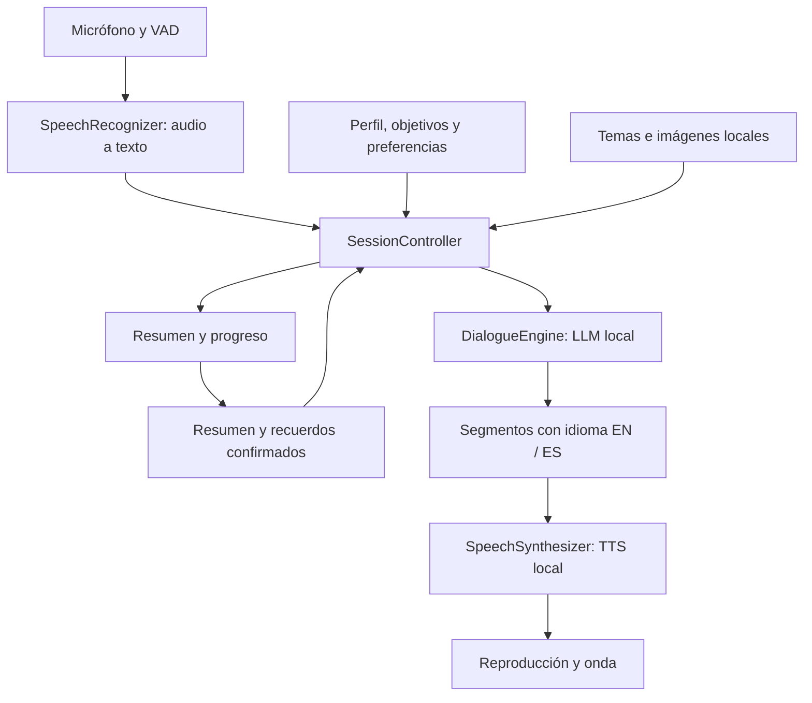

# LearnIt — alcance y plan técnico

**Estado:** Fase 1/2 en implementación; modelos reales pendientes de validación<br>
**Público:** adultos<br>
**Idioma de la interfaz inicial:** español<br>
**Nombre de trabajo:** LearnIt<br>
**Compatibilidad inicial:** Android 12+ e iOS 16+, dispositivos ARM64

La implementación actual entrega el esqueleto Flutter, el flujo textual de demostración, captura PCM16 temporal, reproducción local, persistencia, verificación de paquetes y puentes nativos de sesión. Los pesos reales y sus adaptadores de inferencia se incorporan después de cerrar la Fase 1 en dispositivos físicos.

## 1. Objetivo

LearnIt es una aplicación móvil para practicar inglés con un compañero digital configurable. El usuario podrá hablar en inglés, español o alternar ambos idiomas; el flujo audio → texto → diálogo → texto → audio se ejecutará en el dispositivo después de descargar los recursos.

El compañero conservará una memoria local editable: preferencias confirmadas, temas conversados, vocabulario, objetivos y resúmenes. El modelo no se reentrenará durante el uso. El nivel mostrado será una estimación de práctica, nunca una certificación oficial.

## 2. Alcance acordado

### Incluido en la primera versión pública

- Android e iOS con interfaz compartida en Flutter.
- Conversación por turnos, libre o guiada por temas.
- Reconocimiento de voz y síntesis locales para inglés, español y mezcla de idiomas.
- Misma identidad de voz en ambos idiomas, sujeta a la prueba de inteligibilidad.
- Correcciones desactivadas, suaves o detalladas; modo suave por defecto.
- Compañero configurable: nombre, personalidad, ritmo y frecuencia de corrección.
- Recuerdos revisables, editables y eliminables.
- Progreso por tiempo, objetivos, vocabulario, temas y dificultades.
- Imágenes de temas empaquetadas en la aplicación.
- Onda calculada desde el audio reproducido e indicadores separados para escuchar, procesar y reproducir.
- Sesiones manos libres iniciadas con la aplicación visible que continúan al bloquear la pantalla.
- Dos perfiles de capacidad y descarga inicial de modelos; después de la instalación, práctica sin conexión.

La interfaz inicial tendrá cinco áreas: Inicio, Conversación, Temas, Progreso y Ajustes/Memoria. El catálogo inicial contendrá 20 temas ilustrados, desde situaciones cotidianas hasta conversación de opinión; las imágenes se distribuirán como recursos locales con licencia documentada.

### Fuera de alcance inicial

Escucha permanente fuera de una sesión, interrupciones simultáneas, clonación de voz, entrenamiento o fine-tuning en el teléfono, generación de imágenes, sincronización entre dispositivos, cuentas, publicidad, telemetría remota y puntuación acústica de pronunciación.

## 3. Perfiles de capacidad

Los límites son objetivos de producto que deben comprobarse con el binario final. El espacio temporal para descargar o actualizar puede ser mayor que el espacio instalado.

| Perfil | Dispositivo objetivo | Paquete instalado | Modelo conversacional a comparar |
|---|---|---:|---|
| Básico | Android económico y iPhone con 4 GB de RAM | ≤2 GB | Qwen3.5-0.8B y Qwen3.5-2B cuantizados; se instala uno solo |
| Avanzado | Dispositivo validado de 8 GB de RAM o más | ≤4 GB | Qwen3.5-4B cuantizado; usar 2B si las mediciones lo exigen |

La RAM disponible no equivale a la RAM nominal del teléfono. Cada perfil debe pasar simultáneamente las pruebas de calidad y rendimiento; si C1 no supera la evaluación, se publicarán los límites comprobados en lugar de prometer cobertura general.

## 4. Arquitectura propuesta



### Capas y responsabilidades

- **Flutter/Dart:** navegación, pantallas, ajustes, catálogo de temas y gráficos.
- **C++ compartido:** coordinación de inferencia, segmentación de respuestas, contexto y adaptadores de modelos.
- **Kotlin/Android:** captura, reproducción, permisos, servicio en primer plano, notificación y controles externos.
- **Swift/Objective-C++/iOS:** `AVAudioSession`, interrupciones, bloqueo y puente al núcleo.
- **SQLite local:** datos persistentes; el trabajo pesado se ejecuta en workers nativos, nunca en el hilo de interfaz.
- **FFI/canales:** comandos y eventos tipados entre Flutter y el núcleo. La sesión no dependerá de que una pantalla siga montada.

### Interfaces internas

```text
SessionController  start() pause() resume() finish() -> SessionState events
SpeechRecognizer   transcribe(AudioChunk) -> Transcript {text, language, confidence}
DialogueEngine      reply(Context) -> Reply {segments[], corrections[], memoryProposals[]}
SpeechSynthesizer   synthesize(Segment {text, language, voiceStyleId}) -> AudioStream
MemoryStore         query() saveSummary() confirm() edit() delete()
ModelManager        inspect() download() verifySha256() activate() remove()
```

Las respuestas del modelo se validan antes de cambiar SQLite. Un JSON inválido, una cancelación o un fallo de audio deben producir un estado recuperable y no borrar recuerdos.

## 5. Modelos y licencias

| Función | Candidatos de viabilidad | Runtime previsto | Criterio de selección |
|---|---|---|---|
| Audio → texto | Whisper `tiny` y `base` multilingües | [whisper.cpp](https://github.com/ggml-org/whisper.cpp) | Conserva el idioma original y reconoce alternancia dentro de una frase |
| Diálogo | [Qwen3.5-0.8B](https://huggingface.co/Qwen/Qwen3.5-0.8B), 2B y 4B cuantizados | [llama.cpp](https://github.com/ggml-org/llama.cpp) | Calidad educativa por nivel, latencia, RAM y continuidad de contexto |
| Texto → audio | [Supertonic 3](https://github.com/supertone-oss-archive/supertonic); Supertonic 2 como sustituto | ONNX Runtime directo, CPU | Misma voz EN/ES, inteligibilidad, tamaño y estabilidad |

Whisper y sus variantes móviles son candidatos de ejecución local; no se usarán modelos `.en` porque son exclusivos de inglés. [Flutter permite integrar canales de plataforma y código nativo](https://docs.flutter.dev/platform-integration/platform-channels), mientras que el núcleo de inferencia se mantendrá independiente de la interfaz. Supertonic procesa texto multilingüe con etiquetas de idioma y no requiere Piper/eSpeak en la ruta ONNX directa. Su repositorio está archivado: se fijará una revisión, se conservarán copias autorizadas y el adaptador permitirá sustituirlo.

Las licencias de código y de pesos se inventariarán por artefacto. Qwen publica sus pesos bajo Apache 2.0; Supertonic publica los pesos bajo OpenRAIL-M. Para distribución comercial cerrada se conservarán avisos y licencias, se marcarán conversiones/cuantizaciones, se comunicarán las restricciones de uso aplicables y se identificará el compañero como generado por IA. Esto requiere revisión legal del inventario final.

Cada paquete tendrá `modelId`, versión, URL de procedencia, licencia, SHA-256, tamaño instalado y espacio temporal requerido. No se distribuirán simultáneamente dos LLM en un mismo perfil.

## 6. Gestión de audio, memoria y energía

### Turno de conversación

1. Activar captura y VAD solo durante la intervención del usuario.
2. Mantener el audio en memoria; enviar un bloque final a STT.
3. Enviar texto, nivel, objetivo, estilo, recuerdos relevantes y resumen a `DialogueEngine`.
4. Emitir respuestas cortas por segmentos de idioma.
5. Sintetizar y reproducir una cola limitada; no volver a escuchar el altavoz como entrada.
6. Actualizar resumen, progreso y propuestas de memoria en segundo plano después de comenzar la respuesta audible.

El audio y la transcripción completa serán efímeros. Cada turno completado guarda solo métricas, resumen actualizado y recuerdos que el usuario confirme. Si el sistema termina el proceso antes de ese punto, se pierde el turno pendiente y se recupera el último resumen; no se promete reconstrucción literal.

El perfil básico empieza con contexto de 2.048 tokens y el avanzado con 4.096. Se recuperan recuerdos relevantes en vez de enviar todo el historial. No se cargará un segundo LLM para resumir: el mismo modelo hará esa tarea fuera del recorrido de la primera respuesta.

### Pantalla bloqueada

- **Android:** iniciar desde una actividad visible un foreground service con permisos `RECORD_AUDIO`, `FOREGROUND_SERVICE` y los tipos de micrófono/reproducción adecuados; mostrar una notificación con pausar/finalizar. Probar las restricciones de Android 14+ y los modos de ahorro de energía.
- **iOS:** configurar `AVAudioSession.playAndRecord`, permiso de micrófono y `UIBackgroundModes=audio`. La ruta bloqueada será CPU; no dependerá de nuevos command buffers de Metal en background.
- En ambas plataformas, pausar al perder el foco o ante una interrupción no recuperable. El cierre o eliminación por el sistema exige reanudación explícita del usuario.
- Los archivos necesarios durante bloqueo usarán protección compatible con `after first unlock`; no se guardarán grabaciones ni transcripciones persistentes.

## 7. Persistencia local

```text
profiles(id, declared_level, goals, language_preferences, created_at)
companions(id, name, personality, voice_style_id, correction_mode, speaking_rate)
memories(id, key, value, source_session_id, confirmed_at, updated_at)
session_summaries(id, started_at, ended_at, topics, summary, last_turn_state)
progress(id, metric, value, level, evidence_session_id, recorded_at)
model_packages(id, profile, component, version, sha256, license, size_bytes, status)
```

Los recuerdos inferidos llegan como propuestas. La interfaz debe permitir confirmar, editar y borrar un recuerdo; el borrado debe eliminar sus referencias en resúmenes y contexto futuro. La base local y sus claves se protegerán con los mecanismos del sistema operativo. La base, los modelos y los temporales se excluirán de copias automáticas del sistema cuando la plataforma lo permita. No habrá backup cloud ni registros con contenido conversacional.

## 8. Fases de implementación

### Fase 0 — Especificación (este documento)

Cerrar requisitos, flujos, bocetos, interfaces, esquema local, matriz de modelos/licencias, backlog y trazabilidad requisito → prueba. No se implementa todavía la aplicación.

### Fase 1 — Spike de viabilidad de voz y conversación

Construir una prueba nativa mínima STT → LLM → TTS, comparar `tiny/base`, LLM 0.8B/2B/4B y Supertonic 3/2, probar mezcla EN/ES, misma voz y sesiones bloqueadas en Android/iOS. Entregar matriz de latencia, RAM, tamaño, temperatura, batería, errores e inteligibilidad. Esta fase decide qué combinaciones pueden continuar.

### Fase 2 — Flutter e instalación

Crear proyecto Flutter, puente FFI, gestor de modelos, bienvenida, permisos, descarga reanudable, verificación SHA-256, selección de perfil, espacio disponible y funcionamiento desde cero en modo avión.

### Fase 3 — Práctica

Implementar `SessionController`, conversación por temas/libre, correcciones, repetición, velocidad, entrada de texto en pantalla abierta, estados de audio, onda, imágenes locales, cancelación y recuperación de interrupciones.

### Fase 4 — Compañero y memoria

Implementar configuración de personalidad/voz, SQLite, resúmenes incrementales, propuestas de memoria, confirmación/edición/borrado y continuación entre sesiones. Validar pérdida controlada del turno pendiente.

### Fase 5 — Progreso y niveles

Implementar objetivos, vocabulario, dificultades, temas recomendados y estimación A1–C1. Publicar por perfil solo las capacidades que pasen la evaluación; no usar el resultado como certificación.

### Fase 6 — Beta y tiendas

Optimizar accesibilidad, consumo y tamaño; probar actualizaciones/migraciones, documentar privacidad y licencias, crear fichas de tiendas, distribuir beta y hacer lanzamiento gradual por combinaciones de dispositivo y perfil.

## 9. Criterios de aceptación

### Rendimiento y estabilidad

- Objetivo inicial con modelos cargados: primera respuesta audible ≤6 s de mediana y ≤12 s en p95 tras una intervención de hasta 10 s.
- Sesiones de 30 minutos visibles y bloqueadas sin cierre ni crecimiento continuo de memoria.
- Medir en al menos un Android y un iPhone de 4 GB y uno de mayor capacidad por perfil; registrar modelo, chip, RAM y sistema.
- Cumplir ≤2 GB básico y ≤4 GB avanzado de espacio instalado; informar el espacio temporal de descarga.
- Repetir en frío/caliente, modo avión, presión de memoria, calentamiento y ahorro de energía.

### Voz bilingüe

- Corpus de 90 intervenciones: 30 EN, 30 ES y 30 mixtas, con acentos, pausas, ruido y errores A1–B2.
- Verificar `ñ`, tildes, `¿¡`, números, nombres y cambios de idioma dentro de una frase.
- Evaluar omisiones, traducciones indebidas, inteligibilidad, pronunciación y continuidad de la misma voz.

### Calidad educativa

- Screening de 100 casos: 20 por A1, A2, B1, B2 y C1, más 20 frases correctas de control.
- Revisión por una persona competente en enseñanza de inglés.
- Medir por nivel y perfil precisión de corrección, detección de errores, falsas correcciones, registro, naturalidad, explicación en español y coherencia a 20 turnos.
- Objetivo inicial: ≥95 % de precisión en correcciones propuestas y ≤5 % de falsas correcciones en controles. Estos números son una puerta de aceptación del prototipo, no una garantía de dominio C1.

### Privacidad y recuperación

- Confirmar que no hay solicitudes de red durante la práctica.
- Confirmar que audio y transcripciones no aparecen en archivos, logs ni backups.
- Probar bloqueo durante escucha, STT, LLM y reproducción; llamadas, auriculares, pérdida de foco, pausa y finalización externa.
- Probar cierre por el sistema, reinicio, descarga interrumpida, espacio insuficiente, paquete corrupto y borrado de recuerdos.

## 10. Riesgos y decisiones pendientes

1. **Calidad A1–C1:** el tamaño del modelo y benchmarks generales no prueban correcciones docentes. La puerta de aceptación se decide por nivel, perfil y dispositivo.
2. **RAM y batería:** pesos, cachés, STT, TTS, SQLite e interfaz compiten por recursos. Se debe medir la cadena completa y cargar un único LLM.
3. **Idioma mezclado:** STT y TTS deben probar frases reales de alternancia; el idioma automático no se dará por suficiente.
4. **Pantalla bloqueada:** los sistemas pueden finalizar procesos o limitar CPU/GPU en ahorro. La continuidad no se prometerá bajo todos los modos del sistema.
5. **Supertonic archivado:** fijar versión y mantener `SpeechSynthesizer` sustituible; revisar OpenRAIL-M y voces antes de publicar.
6. **Memoria efímera:** el último resumen es el punto de recuperación; un turno incompleto puede perderse por diseño.

Decisiones pendientes antes de Fase 2: dispositivos exactos de prueba, versiones mínimas de Android/iOS, pesos y voces concretos con hashes, proveedor de imágenes con licencia compatible, política de actualizaciones, texto legal de IA/OpenRAIL-M y umbrales de calidad por cada nivel.

## 11. Fichas de funcionalidad y trazabilidad

| ID | Funcionalidad | Entradas y comportamiento | Error recuperable | Fase / prueba |
|---|---|---|---|---|
| F-01 | Preparar recursos | Perfil, espacio y paquete; descarga reanudable, SHA-256 y activación atómica | Paquete corrupto o espacio insuficiente conserva el `.part` para reintentar | F2 / instalación en modo avión |
| F-02 | Turno de voz | PCM16 temporal → STT → diálogo → segmentos EN/ES → TTS → reproducción | Permiso, interrupción o codec dejan la sesión en un estado visible y sin guardar audio | F1–F3 / corpus de 90 turnos |
| F-03 | Entrada de texto | Texto abierto con idioma automático o indicado; usa el mismo `SessionController` | Respuesta vacía o JSON inválido no modifica memoria | F3 / 20 casos por nivel |
| F-04 | Compañero configurable | Nombre, personalidad, voz, velocidad y correcciones; se guarda en SQLite | Valor inválido vuelve al valor seguro y permite continuar | F4 / persistencia y reinicio |
| F-05 | Memoria confirmada | El modelo propone clave/valor; la persona confirma, edita o borra | Cancelar no crea hechos; borrar elimina el registro y su uso futuro | F4 / recuperación y borrado |
| F-06 | Progreso | Tiempo, turnos, palabras, temas y nivel orientativo | Cierre durante un turno conserva el último resumen válido | F5 / evaluación educativa |
| F-07 | Sesión bloqueada | Servicio Android o `AVAudioSession` iOS mantiene una sesión iniciada visible | Llamada, foco perdido o terminación exige pausar o iniciar de nuevo | F1/F3/F6 / matriz física |

Los contratos Dart en `lib/services/` son los puntos de sustitución de los motores de demostración por los adaptadores nativos seleccionados en F1. Cada ficha debe conservar su ID en las incidencias, pruebas de dispositivo y notas de versión; una capacidad solo se publicará cuando su prueba de aceptación esté enlazada al paquete exacto distribuido.
